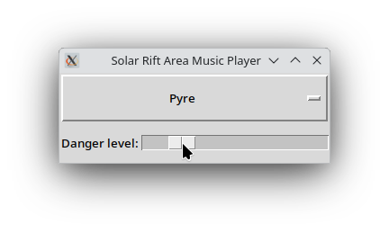

# Solar Rift Area Music Player

This little program plays the adaptive music from the Flash game [Solar Rift](https://armorgames.com/play/13120/solar-rift), with a slider that lets you choose the danger level you wish to emulate. The code itself is under the [Creative Commons Attribution 4.0 license](https://creativecommons.org/licenses/by/4.0/). The included music is owned by its creator, [Zach Striefel](https://www.zachstriefel.com/), distributed with his permission.

This program was written in Python 3.13, and depends on the following non-standard Python libraries:
- [PyDub](https://pypi.org/project/pydub/)
- [PyGame](https://pypi.org/project/pygame/)

A packed executable version of the app, with Python and the dependencies (and the music) all bundled, is available in [the Releases page of this repository](https://github.com/thelabcat/solar-rift-music-player/releases).

When it launches, the app may take several seconds to trim off the silence at the ends of each track. I could have burned this trimming into the files, but as is (aside from the added meta and changed filenames) they are exactly the way they were when I extracted them from the game SWF file.

You can listen to pre-mixed versions of the music with steadily increasing danger levels [here](https://rumble.com/playlists/HUIhonMpgFM), along with the main menu music, which is not adaptive.

Enjoy!
S.D.G.
